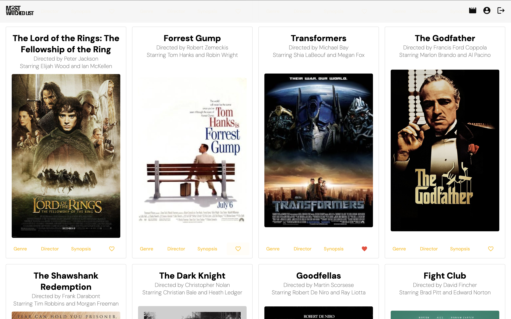
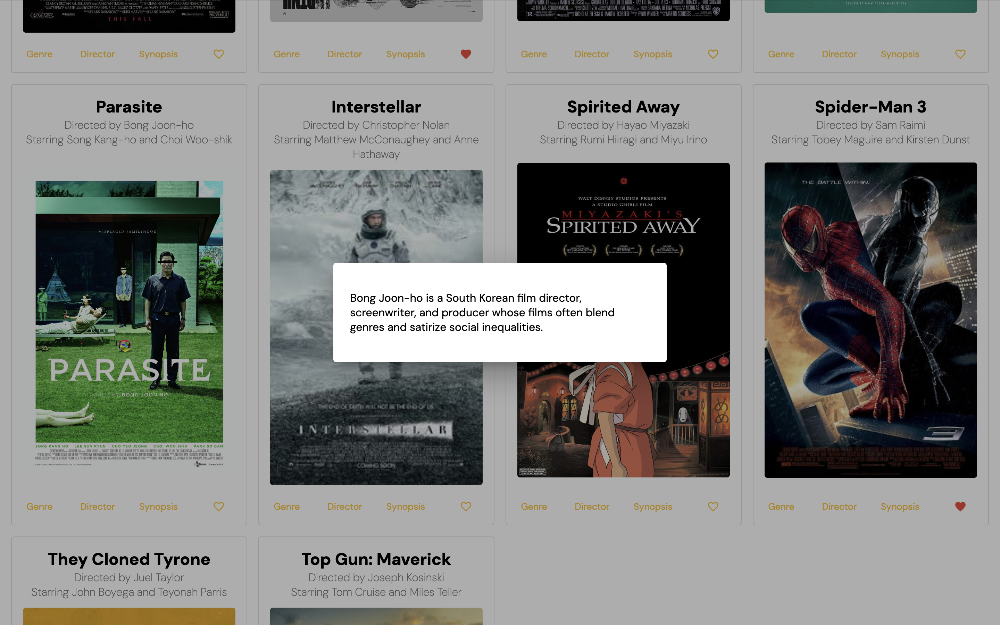
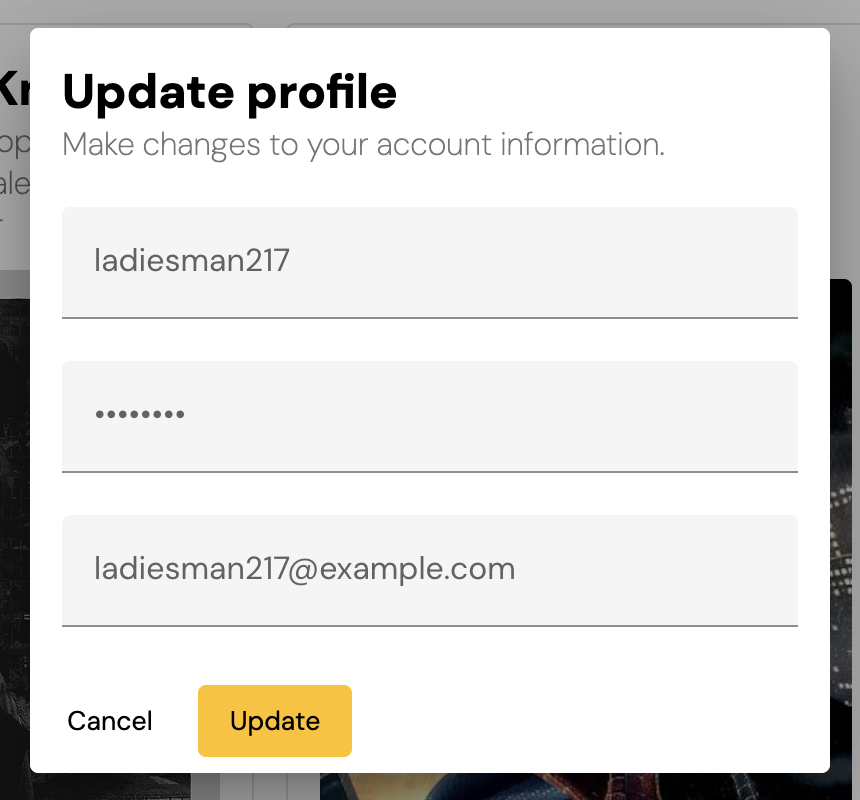

# Most Watched List (Angular)

The Angular-built client-side for an application called Most Watched List based on its existing server-side code (REST API and database), with supporting documentation.

## Features

- Register and login a user
- View a list of movie cards with information about each movie, such as featured actors, directors, etc.
- Add or remove movies a user's favorites list

## Tools

## Development server

Run `ng serve` for a dev server. Navigate to `http://localhost:4200/`. The application will automatically reload if you change any of the source files.

## Code scaffolding

Run `ng generate component component-name` to generate a new component. You can also use `ng generate directive|pipe|service|class|guard|interface|enum|module`.

## Usage

### Main View

The main view includes movie cards for all of the movies in the database. The actions at the bottom of each card trigger a modal with more details: 
 

### Profile View

The profile view renders the user's username, email, and favorite movies: 
 

## Build for GitHub Pages

1. Run `ng build --output-path docs --base-href /your-project-name/` to build the project. The build artifacts will be stored in the `dist/` directory.

   _**Note:** Be sure to include the slashes on either side of your project name as in `/your_project_name/`_

2. When the build is complete, make a copy of `docs/index.html` and name it `docs/404.html`.

3. Commit your changes and push.
