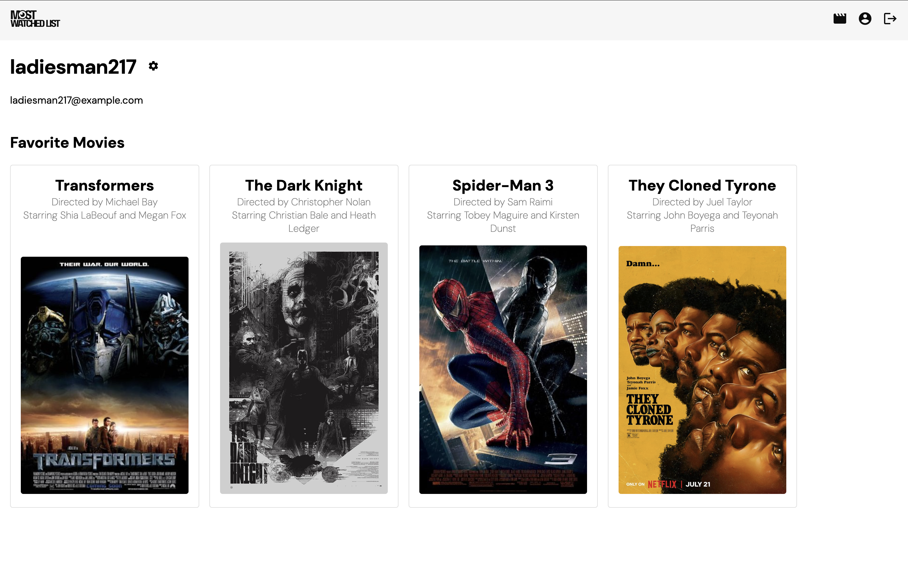

# Most Watched List (Angular)

The Angular-built client-side for an application called Most Watched List based on its existing server-side code (REST API and database), with supporting documentation.

Hosted Site: [MostWatchedList](https://most-watched-list.firebaseapp.com/movies)

## Features

- Register and login a user
- View a list of movie cards with information about each movie, such as featured actors, directors, etc.
- Add or remove movies a user's favorites list

## Tools

## Development server

Run `ng serve` for a dev server. Navigate to `http://localhost:4200/`. The application will automatically reload if you change any of the source files.

## Code scaffolding

Run `ng generate component component-name` to generate a new component. You can also use `ng generate directive|pipe|service|class|guard|interface|enum|module`.

## Usage

### Main View

The main view includes movie cards for all of the movies in the database. The actions at the bottom of each card trigger a modal with more details:<br>
 

### Profile View

The profile view renders the user's username, email, and favorite movies:<br>
 

## Hosting with Firebase

1. Run `npm run build` to build the app for deployment.<br>
   _**Note:** A folder `dist/your-app-name` will be created in the root directory of the project._
2. Set up a Firebase project to associate with this application in the Firebase console.
3. Install the Firebase CLI with `npm install -g firebase-tools`.
4. Log into Firebase using `firebase login`.
5. Initialize the project with `firebase init hosting`.<br><br>_The Firebase CLI will provide prompts in the terminal_
6. Select the Firebase project you are using for this application.
7. Specify the public folder as `dist/your-app-name`
8. Configure as a single-page app (i.e., enter "y").
9. Do not overwrite dist/your-app-name/index.html (i.e., enter "n").
10. Run `firebase deploy` and the Firebase CLI will provide a Hosting URL in the terminal.

## Push Documentation

Creates a new folder `/documentation` and writes output to it.

```sh
npx typedoc --out documentation
```

The output documentation can be accessed in `documentation/modules.html` using the Live Server. The above command needs to be run in order to view changes that are made in the typedoc comments.<br><br>
Be sure to push these changes to GitHub.
